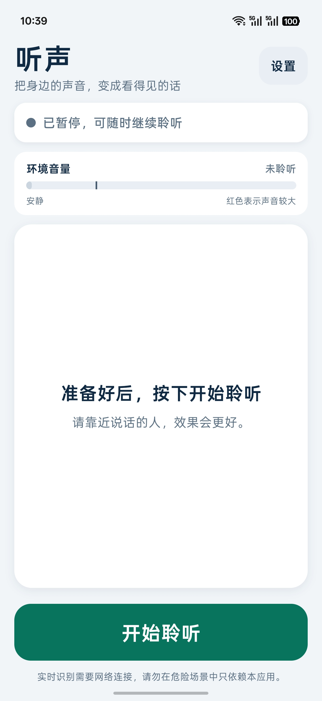
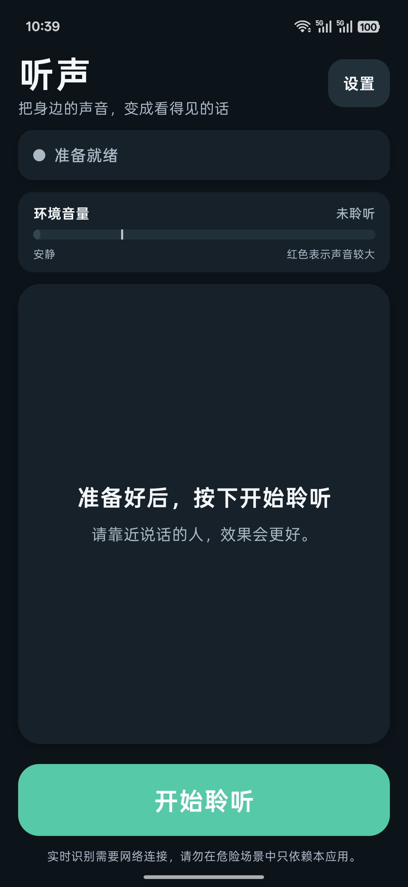

# 听声 LisVoice

听声是一款面向老年听障用户的 Android 实时字幕应用。它通过手机麦克风采集 16 kHz 单声道 PCM 音频，并使用阿里云百炼 Qwen-ASR Realtime 将身边说话内容实时显示为大字字幕。

## 界面预览

<table>
  <tr>
    <th>浅色主题</th>
    <th>深色主题</th>
  </tr>
  <tr>
    <td></td>
    <td></td>
  </tr>
</table>

## 主要功能

- 真正的实时流式语音识别
- 固定字幕区域与自动滚动，长时间聆听不会无限扩展页面
- 可选全屏聆听模式，隐藏辅助信息并最大化字幕显示范围
- 全屏模式提供左侧紧凑音量指示和悬浮停止按钮
- 可随时关闭全屏模式，使用保留标题、状态与横向音量条的传统布局
- 逐字轻震动提示
- 实时环境音量条，以绿色和红色提示声音强弱
- 可调声音过滤阈值，减少安静环境中的误识别
- 跟随系统、浅色与深色主题
- 可调字幕大小和粗细
- API Key 使用 Android 安全存储保存
- 从 GitHub Releases 检查新版本

## 技术栈

- React Native 0.86
- Expo SDK 57
- Expo Modules API 自定义 Android 原生模块
- Kotlin `AudioRecord`
- 阿里云百炼 `qwen3-asr-flash-realtime`

## 本地开发

准备 Node.js、Android Studio、Android SDK、JDK 17，并连接已启用 USB 调试的 Android 手机。

```bash
npm install
npm run android
```

首次启动后，在设置中填写百炼 API Key、WebSocket 服务端点和模型名称。

在“显示”设置中可以选择主题、字幕大小、字幕粗细和全屏聆听模式。全屏聆听默认开启；关闭后，聆听过程中仍会显示标题、连接状态和完整环境音量条。

## GitHub Actions 构建 APK

仓库中的 `Build Android APK` 工作流会在以下场景运行：

- 推送到 `main`：构建 APK，并作为 Actions Artifact 保存 30 天
- 手动运行工作流：构建 APK
- 推送 `v*` 标签：构建 APK，并自动创建 GitHub Release

生成的是一个同时支持以下两种 ARM 架构的 APK：

- `arm64-v8a`：现代 64 位 Android 手机
- `armeabi-v7a`：较旧的 32 位 ARM Android 设备

工作流会检查并拒绝包含 `x86` 或 `x86_64` 原生库的 APK。

## 发布新版本

先同步修改 `app.json`、`package.json` 和 `package-lock.json` 中的版本号，然后提交并创建同版本标签：

```bash
git add app.json package.json package-lock.json
git commit -m "release: v1.0.2"
git tag v1.0.2
git push origin main
git push origin v1.0.2
```

GitHub Actions 完成后，APK 会出现在仓库的 Releases 页面。应用内的“检查更新”会读取最新 Release，并引导用户下载其中的 APK。

## 隐私与安全

- 不要把百炼 API Key 提交到 GitHub。
- API Key 由用户在手机端填写，并保存在 `expo-secure-store` 中。
- 音频会发送到用户所配置的阿里云百炼服务端点进行识别。

## 仓库

[github.com/ybm911/LisVoice](https://github.com/ybm911/LisVoice)

## License

参见 [LICENSE](LICENSE)。
